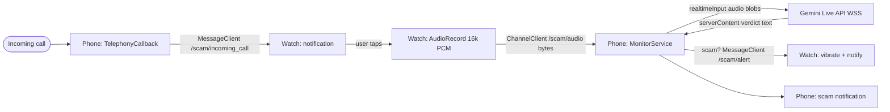

# Live Scam Call Detector

Native Android/Kotlin app with a **phone module** (`:mobile`) and a **Wear OS module** (`:wear`). On an incoming call the watch is notified, the user taps to start capturing mic audio, that audio streams over the Wear OS Data Layer to the phone, the phone streams it live to the **Gemini Live API**, and a scam verdict triggers a watch vibration plus phone/watch notification — all in real time during the call.

## Architecture



## Modules

| Module | Role |
|--------|------|
| `:common` | Shared Data Layer paths, audio format, Gemini JSON helpers, verdict parser |
| `:mobile` | Incoming-call detection, audio channel receiver, Gemini Live client, alerts |
| `:wear` | Tap-to-monitor notification, mic/debug-clip capture, scam alert vibration |

## Prerequisites

- Android Studio Ladybug or newer
- Android SDK 35
- JDK 17+
- Paired phone + Wear OS device or emulators on the same host
- Gemini API key

## API key setup

Add your key to `local.properties` (this file is gitignored):

```properties
sdk.dir=/path/to/Android/Sdk
GEMINI_API_KEY=your_key_here
```

The build exposes it as `BuildConfig.GEMINI_API_KEY` in `:mobile`.

For quick testing you can use an ephemeral token (regenerate if auth fails). Set it only in `local.properties`, never commit it:

```properties
GEMINI_API_KEY=AQ.your_ephemeral_token_here
```

## Build

```bash
./gradlew :mobile:assembleDebug :wear:assembleDebug
./gradlew :common:test
```

APK outputs:

- `mobile/build/outputs/apk/debug/mobile-debug.apk`
- `wear/build/outputs/apk/debug/wear-debug.apk`

## Emulator ↔ phone pairing (validate first)

Data Layer pairing is the fiddliest setup step. Try this order:

### Option A — Physical phone + Wear OS emulator (plan default)

1. Enable **Developer options** and **USB debugging** on the phone.
2. Install `:mobile` on the phone (`Run > mobile`).
3. Create a **Wear OS** emulator in Device Manager and install `:wear`.
4. Install the **Wear OS** (or Galaxy Watch) companion app on the phone.
5. Forward the emulator bridge:

   ```bash
   adb -s <wear-emulator-id> forward tcp:5601 tcp:5601
   ```

6. Pair the emulator through the companion app (same Google account on both).
7. Confirm connected nodes in logcat: `WearableListenerService` / `connectedNodes`.

### Option B — Two emulators on one machine (fallback)

Data Layer works out of the box between a phone emulator and a Wear OS emulator on the same host — no USB forwarding needed. Use this if physical-phone pairing fails.

## Run instructions

1. Set `GEMINI_API_KEY` in `local.properties`.
2. Build and install both modules.
3. Grant permissions on phone (`READ_PHONE_STATE`, notifications) and watch (`RECORD_AUDIO`, notifications).
4. Ensure watch and phone show as connected in Wearable logs.
5. Trigger monitoring:
   - **Automatic:** place or simulate an incoming call on the phone.
   - **Manual:** tap **Start monitoring** on the phone and **Start** on the watch.
6. On the watch, tap the incoming-call notification to auto-start capture.
7. Watch the phone UI for live `SCAM_RISK` verdicts. A **high** risk triggers `/scam/alert` on the watch (vibrate + notification) and a phone notification.

### Debug audio clip mode

`:wear` ships with `USE_DEBUG_AUDIO_CLIP=true` in `BuildConfig` so emulators can stream a bundled 16 kHz PCM clip (`res/raw/scam_demo_clip.pcm`) instead of the live mic. Toggle in `wear/build.gradle.kts` for hardware mic capture.

### Simulate an incoming call (phone emulator)

```bash
adb -s <phone-emulator> emu gsm call +15551234567
```

## Data Layer paths

| Path | Direction | Purpose |
|------|-----------|---------|
| `/scam/incoming_call` | phone → watch | Prompt user to start monitoring |
| `/scam/audio` | watch → phone | PCM16 16 kHz mono byte stream |
| `/scam/alert` | phone → watch | High-risk scam verdict alert |

## Testing

### JVM unit tests (`:common`)

Covers Gemini setup/realtimeInput JSON framing, base64 PCM encoding, `short[]`→`byte[]` conversion, and `SCAM_RISK` verdict parsing.

```bash
./gradlew :common:test
```

### Two-emulator integration (local)

Requires Android emulators — not runnable on cloud CI VMs without emulator support.

```bash
chmod +x scripts/integration_two_emulator.sh
PHONE_SERIAL=emulator-5554 WEAR_SERIAL=emulator-5556 ./scripts/integration_two_emulator.sh
```

The script installs APKs, starts monitoring, simulates `adb emu gsm call`, and asserts logcat markers for Data Layer traffic and audio byte flow. Verify `/scam/alert` manually when Gemini returns `SCAM_RISK: high`.

### Left to hardware testing

- Physical phone install and real acoustic mic capture
- End-to-end live phone call with a paired physical watch

## Key constants

- Audio: 16 kHz, mono, PCM16, ~100 ms chunks
- Gemini model: `models/gemini-2.5-flash-native-audio-preview-12-2025` (swap in `ScamConfig.GEMINI_LIVE_MODEL`)
- High-risk threshold: `ScamRisk.HIGH`

## Troubleshooting

| Issue | Fix |
|-------|-----|
| No connected watch nodes | Re-pair via Wear OS companion app or use two emulators |
| Gemini auth error | Regenerate ephemeral `AQ.` token in `local.properties` |
| No audio bytes on phone | Start watch capture after phone `MonitorService` is running |
| Emulator mic unavailable | Enable `USE_DEBUG_AUDIO_CLIP` in `:wear` |
