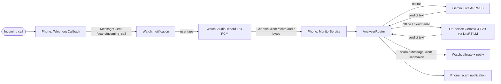

# Live Scam Call Detector

Native Android/Kotlin app with a **phone module** (`:mobile`) and a **Wear OS module** (`:wear`). On an incoming call the watch is notified, the user taps to start capturing mic audio, that audio streams over the Wear OS Data Layer to the phone, the phone analyzes it for scam risk, and a verdict triggers a watch vibration plus phone/watch notification — all in real time during the call.

Analysis runs on the **Gemini Live API** when online. When there is **no internet** (or the cloud connection fails), the phone automatically falls back to an **on-device Gemma 4 E2B** model via [LiteRT-LM](https://developers.google.com/edge/litert-lm), so scam detection keeps working offline. It recovers to the cloud engine when connectivity returns.

## Architecture



## Modules

| Module | Role |
|--------|------|
| `:common` | Shared Data Layer paths, audio format, shared scam prompt, Gemini JSON helpers, verdict parser, WAV/window helpers, engine-selection state machine |
| `:mobile` | Incoming-call detection, audio channel receiver, cloud/on-device analyzer routing, Gemini Live client, on-device Gemma engine, alerts |
| `:wear` | Tap-to-monitor notification, mic/debug-clip capture, scam alert vibration |

## Offline on-device fallback (Gemma 4 E2B)

The feature is **behind a runtime flag and disabled by default** — until you turn it on, the app behaves exactly like the cloud-only path (no on-device analysis, no auto-switching).

When enabled (and the network is unavailable or the Gemini Live connection fails), `AnalyzerRouter` switches to an on-device engine:

- **Model:** `litert-community/gemma-4-E2B-it-litert-lm` (`.litertlm`, ~2.58 GB, Apache-2.0, multimodal with native audio).
- **Runtime:** `com.google.ai.edge.litertlm:litertlm-android` (requires **Kotlin 2.3.0+**), NPU/GPU/CPU with automatic fallback.
- **How audio is handled:** streamed PCM is coalesced into ~12 s windows (Gemma accepts audio clips up to 30 s), wrapped as WAV, and analyzed one window at a time in a stateless conversation that reuses the same `SCAM_RISK: <low|medium|high> | <reason>` contract as the cloud path.
- **Model download:** not bundled. Tap **Download offline model** in the app (downloaded to app storage), or push it manually for development:

  ```bash
  adb push gemma4_e2b.litertlm /sdcard/Download/   # then copy into app files dir, or
  # place the file at: /data/data/com.aicallscreening.mobile/files/gemma4_e2b.litertlm
  ```

- **Device requirements:** physical device (not emulator), ~8 GB RAM, GPU/NPU strongly preferred. Low-RAM devices should stay cloud-only.
- **Trade-offs vs cloud:** higher latency (windowed request/response, not continuous streaming) and more battery use; accuracy depends on the smaller on-device model.
- **Emulator/CI:** set `USE_MOCK_INFERENCE=true` in `local.properties` to use a stub analyzer instead of the real (device-only) runtime and multi-GB model.

### Enabling and toggling the feature

The feature is controlled at runtime via two switches on the phone screen (persisted across launches, applied the next time you start monitoring):

- **Enable offline fallback (beta)** — master flag. Off by default. When off, nothing changes vs. the cloud-only behavior.
- **Force on-device engine (testing)** — pins analysis to the on-device engine regardless of connectivity, so you can exercise the offline path without actually going offline.

**Testing in an emulator** (emulators can't run the real Gemma model):

1. Build with `USE_MOCK_INFERENCE=true` in `local.properties` (uses the stub analyzer).
2. Launch the app and turn on **Enable offline fallback**, then **Force on-device engine**.
3. Tap **Start monitoring** — the "Engine" line shows **On-device (offline)** and the mock analyzer runs, no network changes needed.

To test the real auto-switch on a physical device: enable only **Enable offline fallback** (leave force off), download the model, start monitoring, then toggle airplane mode to watch it fall back and recover.

## Prerequisites

- Android Studio Ladybug or newer
- Android SDK 35
- JDK 17+
- Kotlin 2.3.0+ (pinned in `gradle/libs.versions.toml`; required by LiteRT-LM)
- Paired phone + Wear OS device or emulators on the same host
- Gemini API key (cloud path); optional Gemma 4 E2B model for the offline path

## API key setup

Add your key to `local.properties` (this file is gitignored):

```properties
sdk.dir=/path/to/Android/Sdk
GEMINI_API_KEY=your_key_here
# Optional: use a stub on-device analyzer for emulator/CI (default false)
USE_MOCK_INFERENCE=false
```

The build exposes these as `BuildConfig.GEMINI_API_KEY` and `BuildConfig.USE_MOCK_INFERENCE` in `:mobile`.

For quick testing you can use an ephemeral token (regenerate if auth fails). Set it only in `local.properties`, never commit it:

```properties
GEMINI_API_KEY=AQ.your_ephemeral_token_here
```

## Build

```bash
./gradlew :mobile:assembleDebug :wear:assembleDebug
./gradlew :common:test
```

APK outputs:

- `mobile/build/outputs/apk/debug/mobile-debug.apk`
- `wear/build/outputs/apk/debug/wear-debug.apk`

## Emulator ↔ phone pairing (validate first)

Data Layer pairing is the fiddliest setup step. Try this order:

### Option A — Physical phone + Wear OS emulator (plan default)

1. Enable **Developer options** and **USB debugging** on the phone.
2. Install `:mobile` on the phone (`Run > mobile`).
3. Create a **Wear OS** emulator in Device Manager and install `:wear`.
4. Install the **Wear OS** (or Galaxy Watch) companion app on the phone.
5. Forward the emulator bridge:

   ```bash
   adb -s <wear-emulator-id> forward tcp:5601 tcp:5601
   ```

6. Pair the emulator through the companion app (same Google account on both).
7. Confirm connected nodes in logcat: `WearableListenerService` / `connectedNodes`.

### Option B — Two emulators on one machine (fallback)

Data Layer works out of the box between a phone emulator and a Wear OS emulator on the same host — no USB forwarding needed. Use this if physical-phone pairing fails.

## Run instructions

1. Set `GEMINI_API_KEY` in `local.properties`.
2. Build and install both modules.
3. Grant permissions on phone (`READ_PHONE_STATE`, notifications) and watch (`RECORD_AUDIO`, notifications).
4. Ensure watch and phone show as connected in Wearable logs.
5. Trigger monitoring:
   - **Automatic:** place or simulate an incoming call on the phone.
   - **Manual:** tap **Start monitoring** on the phone and **Start** on the watch.
6. On the watch, tap the incoming-call notification to auto-start capture.
7. Watch the phone UI for live `SCAM_RISK` verdicts. A **high** risk triggers `/scam/alert` on the watch (vibrate + notification) and a phone notification.

### Debug audio clip mode

`:wear` ships with `USE_DEBUG_AUDIO_CLIP=true` in `BuildConfig` so emulators can stream a bundled 16 kHz PCM clip (`res/raw/scam_demo_clip.pcm`) instead of the live mic. Toggle in `wear/build.gradle.kts` for hardware mic capture.

### Simulate an incoming call (phone emulator)

```bash
adb -s <phone-emulator> emu gsm call +15551234567
```

## Data Layer paths

| Path | Direction | Purpose |
|------|-----------|---------|
| `/scam/incoming_call` | phone → watch | Prompt user to start monitoring |
| `/scam/audio` | watch → phone | PCM16 16 kHz mono byte stream |
| `/scam/alert` | phone → watch | High-risk scam verdict alert |
| `/scam/stop_capture` | phone → watch | Stop watch audio capture when call ends |

## Testing

### JVM unit tests (`:common`)

Covers Gemini setup/realtimeInput JSON framing, base64 PCM encoding, `short[]`→`byte[]` conversion, `SCAM_RISK` verdict parsing, the shared scam prompt, WAV header generation, audio windowing, and the cloud/on-device engine-selection state machine.

```bash
./gradlew :common:test
```

### Two-emulator integration (local)

Requires Android emulators — not runnable on cloud CI VMs without emulator support.

```bash
chmod +x scripts/integration_two_emulator.sh
PHONE_SERIAL=emulator-5554 WEAR_SERIAL=emulator-5556 ./scripts/integration_two_emulator.sh
```

The script installs APKs, starts monitoring, simulates `adb emu gsm call`, and asserts logcat markers for Data Layer traffic and audio byte flow. Verify `/scam/alert` manually when Gemini returns `SCAM_RISK: high`.

### Left to hardware testing

- Physical phone install and real acoustic mic capture
- End-to-end live phone call with a paired physical watch

## Key constants

- Audio: 16 kHz, mono, PCM16, ~100 ms chunks (cloud); coalesced into ~12 s windows (on-device)
- Gemini model: `models/gemini-2.5-flash-native-audio-preview-12-2025` (swap in `ScamConfig.GEMINI_LIVE_MODEL`)
- Offline model: Gemma 4 E2B `.litertlm` (`ScamConfig.GEMMA_MODEL_URL` / `GEMMA_MODEL_FILE`)
- High-risk threshold: `ScamRisk.HIGH`

## Troubleshooting

| Issue | Fix |
|-------|-----|
| No connected watch nodes | Re-pair via Wear OS companion app or use two emulators |
| Gemini auth error | Regenerate ephemeral `AQ.` token in `local.properties` |
| No audio bytes on phone | Start watch capture after phone `MonitorService` is running |
| Emulator mic unavailable | Enable `USE_DEBUG_AUDIO_CLIP` in `:wear` |
| Stuck on "On-device model not downloaded" | Tap **Download offline model**, or push the `.litertlm` into app files dir |
| On-device engine crashes / no GPU | GPU libs are optional; it falls back to CPU. Ensure ~8 GB RAM and a physical device |
| Building for emulator/CI | Set `USE_MOCK_INFERENCE=true` in `local.properties` |
